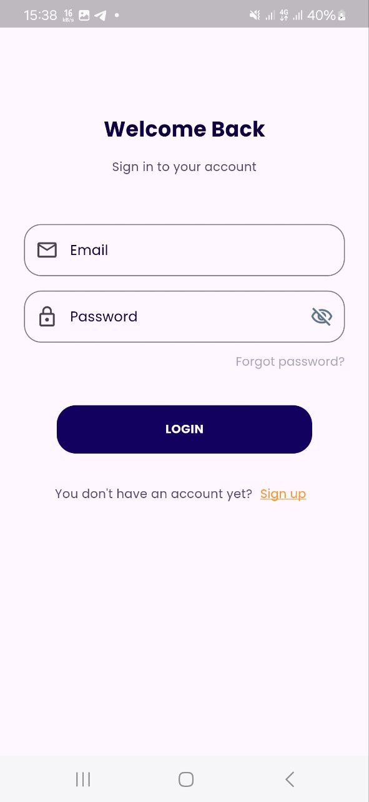
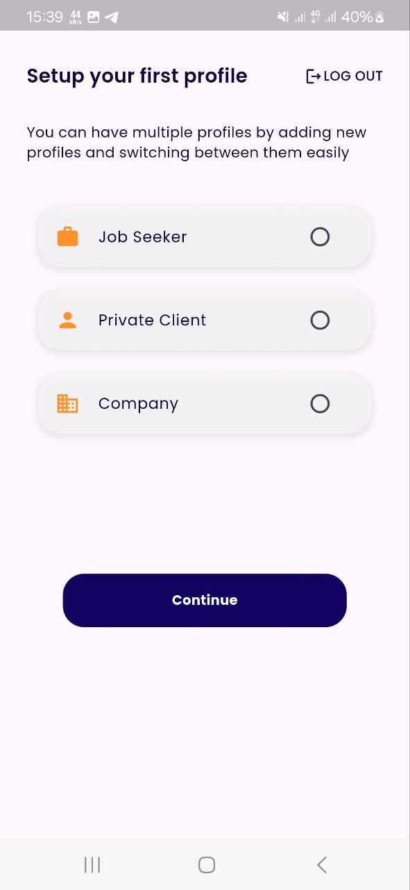

# Job Portal App
## Overview
The Job Portal App connects job seekers with employers, providing an efficient platform for job searching and recruitment. Built with Flutter and Laravel, it supports three user types: Job Seekers, Private Clients, and Companies.

## Features
**Job Seekers**: Create profiles, search jobs, apply, and track application status. 
**Private Clients**: Post jobs and manage applicants. 
**Companies**: Add company details, post jobs, and review applications. 

## Technologies Used

Frontend: Flutter (Dart)  
State management with GetX.  
MySQL for local database management. 
Postman for API testing. 
Backend: Laravel (PHP) 
RESTful APIs for seamless communication. 
Validation and authentication mechanisms. 

Screenshots

     

