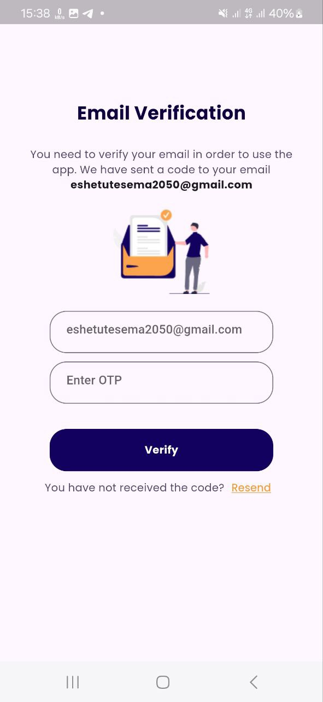

Job Portal App
Overview
The Job Portal App connects job seekers with employers, providing an efficient platform for job searching and recruitment. Built with Flutter and Laravel, it supports three user types: Job Seekers, Private Clients, and Companies.

Features
Job Seekers: Create profiles, search jobs, apply, and track application status.
Private Clients: Post jobs and manage applicants.
Companies: Add company details, post jobs, and review applications.

Technologies Used

Frontend: Flutter (Dart)

State management with GetX.
SQLite for local database management.
Postman for API testing.
Backend: Laravel (PHP)

RESTful APIs for seamless communication.
MySQL for database management.
Validation and authentication mechanisms.

Screenshots

     

